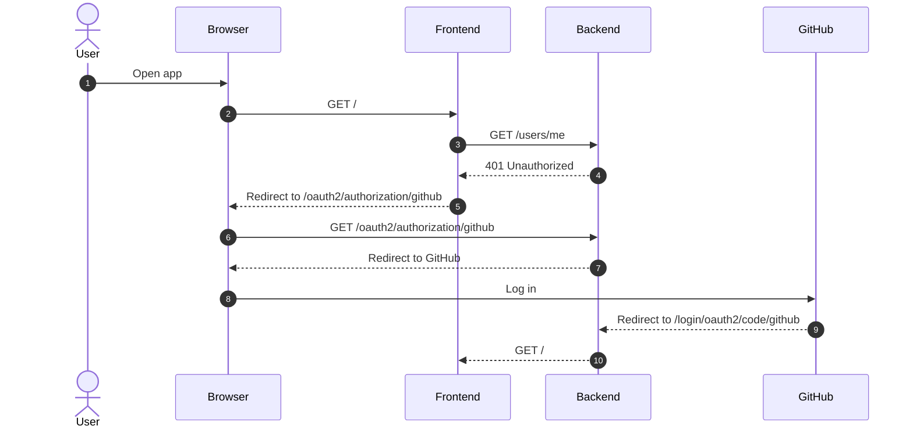

## OAuth Flow using GitHub

```mermaid
sequenceDiagram
  autonumber

  actor User

  participant Browser
  participant Frontend
  participant Backend
  participant GitHub

  User->>Browser: Open app
  Browser->>Frontend: GET /
  Frontend->>Backend: GET /users/me
  Backend-->>Frontend: 401 Unauthorized
  Frontend-->>Browser: Redirect to /oauth2/authorization/github
  Browser->>Backend: GET /oauth2/authorization/github
  Backend-->>Browser: Redirect to GitHub
  Browser->>GitHub: Log in
  GitHub-->>Backend: Redirect to /login/oauth2/code/github
  Backend-->>Frontend: GET /
```
